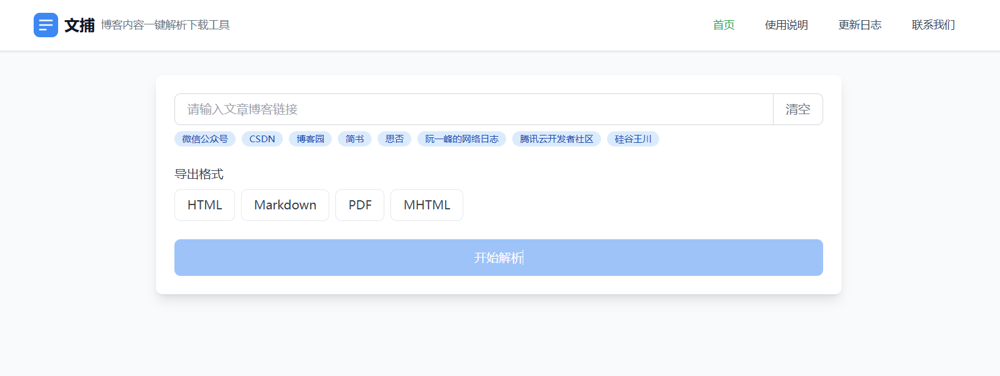

## BlogKeeper-文捕

一款在线博客内容解析下载工具，支持多个平台，多种格式，尽量保留原始文章原始排版

https://www.blog-keeper.com/

### 🌐**多平台支持**

+ 微信公众号/博客园/CSDN/掘金/简书/思否等等

### 📚多格式导出

+ HTML（保留原始样式）
+ PDF（适合归档打印）
+ Markdown（便于编辑）
+ MHTML（单文件保存,完整备份，离线浏览）



## 🚀 快速开始

### 部署

一键部署脚本
```bash
./deploy.sh
```
### 开发

```bash
git clone https://github.com/GailZhangJY/BlogKeeper.git
cd BlogKeeper
```
启动服务器

```bash
# 进入api目录
cd api

# 安装依赖
pip install -r requirements.txt

# 运行
python api.py
```
快速测试
```bash
python main.py [-html] [-pdf] [-md] [-mhtml] [-o] url

# 示例
python main.py -html https://mp.weixin.qq.com/s/bdqcwi0CgkoIvUiKsGBFog
```

启动前端
```bash
# 进入web目录
cd web

# 安装依赖
npm install

# 运行
npm run dev

# 打包
npm run build
```
